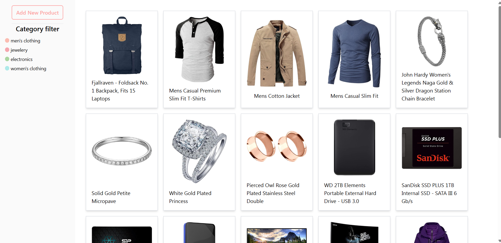
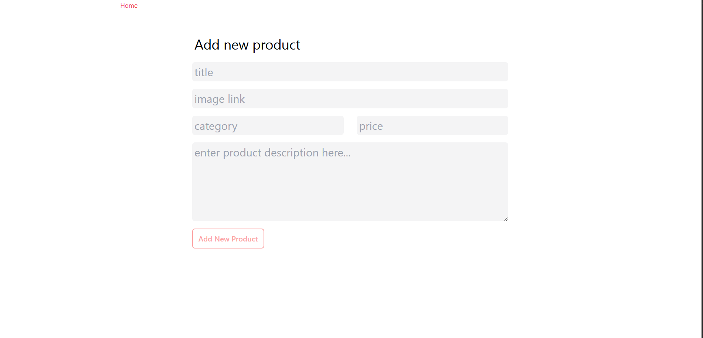
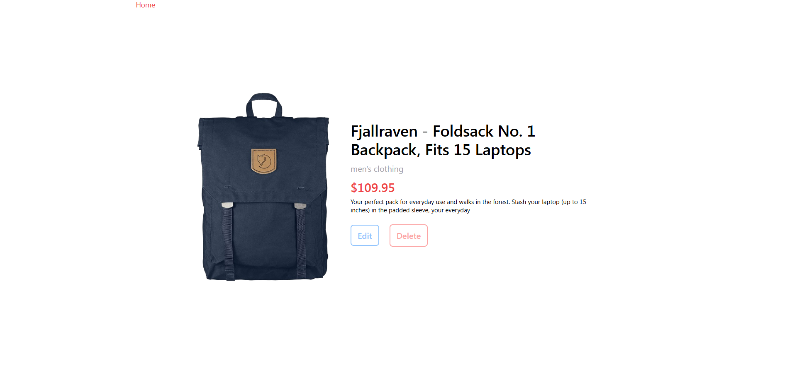

🛍️ React Product Management App

A simple yet powerful product management web app built with React, React Router DOM, Tailwind CSS, React Toastify, Context API, and Local Storage.

This project allows users to create, edit, delete, and categorize products, with all data stored locally in the browser.

🚀 Features

🆕 Add New Product – Create and store product details.

✏️ Edit Product – Update product information easily.

❌ Delete Product – Remove unwanted products.

🗂️ Categorize Products – Organize products into categories.

💾 Persistent Data – Uses Local Storage to save your data even after refreshing.

🌐 React Router DOM – Smooth and structured page navigation.

🎨 Tailwind CSS – Beautiful, responsive UI design.

🔔 React Toastify – Interactive toast notifications.

⚙️ Context API – Global state management for products and categories.

🧩 Tech Stack

Technology	        Purpose
React.js	        Frontend framework
React Router DOM	Client-side routing
Tailwind CSS	    Styling
React Toastify	    Notifications
Context API	State   management
Local Storage	    Data persistence

📂 Folder Structure

ReactWithContextAPI-main/
│
├── src/
│   ├── components/
│   ├── context/
│   ├── pages/
│   ├── App.js
│   ├── index.js
│   └── ...
│
├── public/
│
└── package.json

⚙️ Installation & Setup

Clone the repository

git clone https://github.com/faizurrehman-hubReactWithContextAPI
.git

Navigate to the project folder

cd ReactWithContextAPI-main

Install dependencies

npm install

Run the app

npm start

Open http://localhost:3000
 in your browser 🚀

## 🖼️ Screenshots

### 🏠 Home Page

### ➕ Add Product Page

### ✏️ Edit Product Page

Faizurrehman Mirza
📧 mirzafaiz506@gmail.com
🌐 faizurrehman-hub